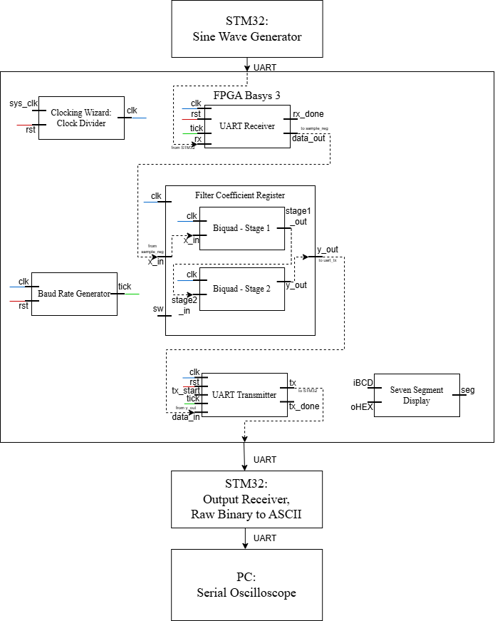

# FPGA Butterworth IIR Filter

Implementation of a **4th-order Butterworth IIR FDigital Filter Based on Biquad Cascade Structure** on an FPGA using **Verilog HDL**. This project was developed as an undergraduate thesis and demonstrates real-time digital signal filtering using an FPGA. An STM32 microcontroller is used as the input sine wave generator, while the filtered output is transmitted back to a PC for visualization using a Serial Oscilloscope.

---

## Features

- Fourth-order Butterworth IIR digital filter implementation
- Biquad cascade structure (Second-Order Sections)
- Parameterized filter coefficients
- Fixed-point arithmetic implementation for FPGA
- Real-time UART data streaming
- STM32-based sine wave generator for hardware testing
- TCL-based Vivado project automation
- Makefile shortcuts for coefficient generation, clock generation, build, and FPGA programming
- Modular Verilog HDL design
  
---

## System Architecture

<p align="center">
  
</p>

1. STM32 generates digital sine wave samples.
2. Samples are transmitted to the FPGA through UART.
3. The FPGA processes the data using a Butterworth IIR filter.
4. Filtered samples are sent back to the PC through UART.
5. The waveform can be observed using a Serial Oscilloscope.

---

## Default Configuration

| Parameter | Value |
|-----------|-------|
| FPGA Board | Basys3 (Artix-7 XC7A35T) |
| FPGA Clock | 76.5 MHz |
| STM32 Clock | 76.5 MHz |
| UART Baudrate | 478125 bps |
| UART Oversampling | 16× |
| Sampling Frequency | 10 kHz |
| Default Signal Frequency | 1000 Hz |
| Data Width | 16-bit Signed |
| Fixed-Point Format | Q1.14 |

---

# Modify Configuration

The project provides configurable parameters for the FPGA clock and Butterworth filter specifications. Before rebuilding the project, modify the corresponding configuration file as needed.

## Project Variables

Project settings are defined in:

```text
Skripsi_TCL/tcl/set_variables.tcl
```

This file contains configurable project parameters, including:

- FPGA clock configuration
- Target FPGA device
- Project name
- Top module
- Other Vivado project settings

---

## Butterworth Filter

The filter specifications are defined in:

```text
Skripsi_TCL/python/filter_config.py
```

The following parameters can be modified:

- Filter type (Low-pass, High-pass, Band-pass, or Band-stop)
- Filter order
- Cutoff frequency (or passband/stopband frequencies)
- Sampling frequency
- Fixed-point format

# Setup

Before running the project, edit

```text
Skripsi_TCL/setenv.bat
```

and modify the Vivado installation path according to your local installation.

Example:

```bat
D:\Xilinx\2025.1\Vivado\settings64.bat 
```

After that, initialize the environment

```bash
setenv.bat
```

---

# Build Commands

## Generate Clock Wizard

Generate the Clock Wizard IP.

```bash
make clock
```

Run this command during the initial setup or whenever the Clock Wizard configuration is updated.

---

## Generate Filter Coefficients

Generate Butterworth filter coefficients.

```bash
make coeff
```

Run this command during the initial setup or whenever the filter specifications are changed.

---

## Build Project

Create the Vivado project, run synthesis, implementation, and generate the bitstream.

```bash
make build
```

---

## Flash FPGA

Program the generated bitstream to the FPGA.

```bash
make flash
```

---

## Clean Project

Remove generated Vivado files.

```bash
make clean
```

---

# Running the Hardware

## Step 1

Open the STM32 project using STM32CubeIDE.

Compile and flash the firmware to the STM32 board.

The STM32 will continuously generate sine wave samples through UART.

---

## Step 2

Connect

- STM32 TX → FPGA RX
- STM32 RX ← FPGA TX
- Common GND

---

## Step 3

Open a terminal.

Initialize the Vivado environment.

```bash
setenv.bat
```

---

## Step 4

Generate the FPGA bitstream.

```bash
make build
```

---

## Step 5

Download the bitstream.

```bash
make flash
```

---

## Step 6

Open the Serial Oscilloscope application.

Select the FPGA COM port.

The filtered waveform should appear in real time.

---

# Workflow

```text
STM32
   │
   ▼
Generate Sine Wave
   │
   ▼
UART Transmission
   │
   ▼
FPGA Butterworth Filter
   │
   ▼
UART Output
   │
   ▼
Serial Oscilloscope
```

---

# Notes

- Run `make coeff` whenever the cutoff frequency or filter order is modified.
- Run `make clock` if the FPGA clock frequency changes.
- Rebuild the project after modifying RTL files.

---

# Author

**Adji Pangestu**

Undergraduate Thesis Project

Digital Signal Processing on FPGA using Verilog HDL
